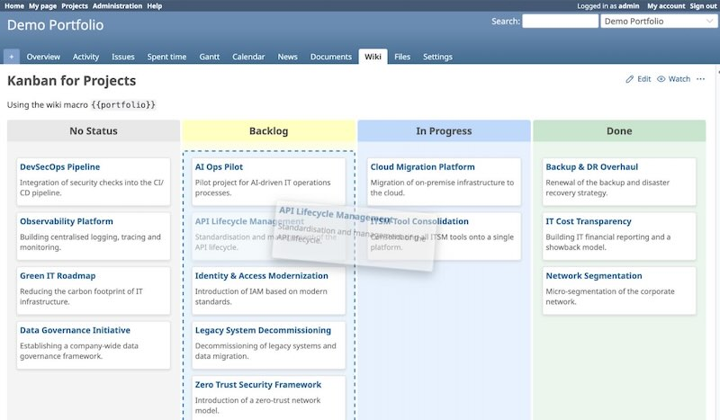

# Redmine Subfolio Plugin


A Redmine plugin for visual portfolio management. Displays subprojects as a kanban board grouped by status, adds a status badge to project pages, and lets authorised users move projects between columns via drag and drop — no external portfolio tool required.

> Built for programme managers and teams who want portfolio visibility without vendor lock-in.

## Screenshots



## Features

- **Kanban board**: `{{portfolio}}` wiki macro renders subprojects as cards grouped by status columns
- **Drag & drop**: move projects between columns — changes persist immediately
- **Status badge**: coloured tag next to the project name on the project overview page
- **Auto-setup**: the required custom field is created automatically on installation
- **Permission control**: only members with the *Manage project status* permission can change status
- **Colour coding**: column colours driven by a suffix on the status value (`-p`, `-i`, `-d`)

## Requirements

- Redmine 5.0 or higher

## Installation

> [!IMPORTANT]
> The plugin directory **MUST** be named `redmine_subfolio` for assets to load correctly.

1. **Clone** into your plugins directory:
   ```bash
   cd /path/to/redmine/plugins
   git clone https://github.com/subversive-tools/redmine_subfolio.git redmine_subfolio
   ```

2. **Run migrations** — this creates the *Project Status* custom field automatically:
   ```bash
   bundle exec rake redmine:plugins:migrate RAILS_ENV=production
   ```

3. **Restart Redmine**.

## Configuration

Navigate to **Administration > Plugins > Subfolio > Configure** to see the active custom field.

### Permissions

Go to **Administration > Roles and permissions** and enable *Manage project status* for roles that should be able to move projects on the kanban board.

### Status values & colour coding

Status values are managed directly on the *Project Status* custom field under **Administration > Custom Fields**. Append a suffix to control the column colour:

| Suffix | Colour | Meaning |
|:---|:---|:---|
| `-p` | yellow | Pool / Backlog / Planning |
| `-i` | blue | In Progress / Active |
| `-d` | green | Done / Delivered / Closed |

**Example values:**
```
Ideas-p
In Progress-i
Review-i
Done-d
```

## Usage

Place the macro on any wiki page within a parent project:

```
{{portfolio}}
```

All active, visible subprojects appear as cards grouped by their status value. Projects without a status appear in a *No Status* column on the left. Members with the *Manage project status* permission can drag cards between columns to update status immediately.

## Troubleshooting

**Macro shows as plain text `{{portfolio}}`?**
- Check that the plugin is installed and migrations have been run.
- Verify the wiki page formatter supports macros (Textile or CommonMark with macros enabled).

**Drag and drop has no effect?**
- Ensure the user has the *Manage project status* permission in the project.

## Contributing

Contributions are welcome — please fork the repository and open a Pull Request.

1. Fork it
2. Create your feature branch (`git checkout -b feature/my-feature`)
3. Commit your changes
4. Push to the branch
5. Open a Pull Request

## License

[MIT License](LICENSE) — Copyright (c) 2026 Stefan Mischke
